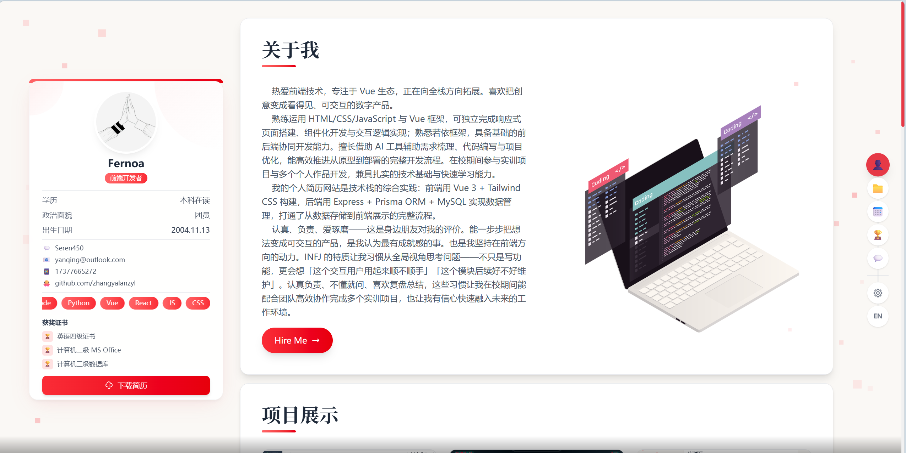
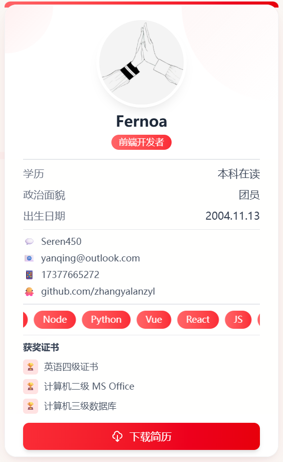
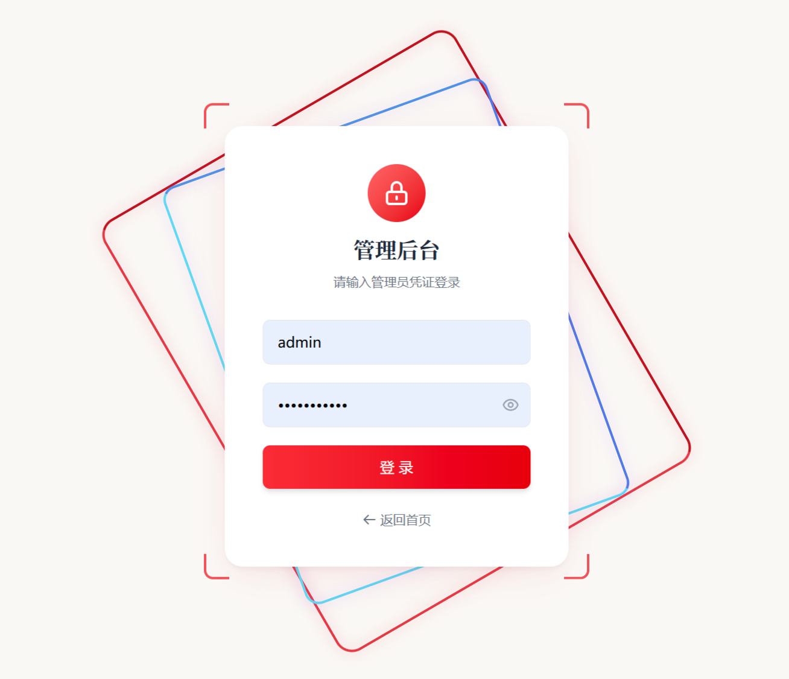
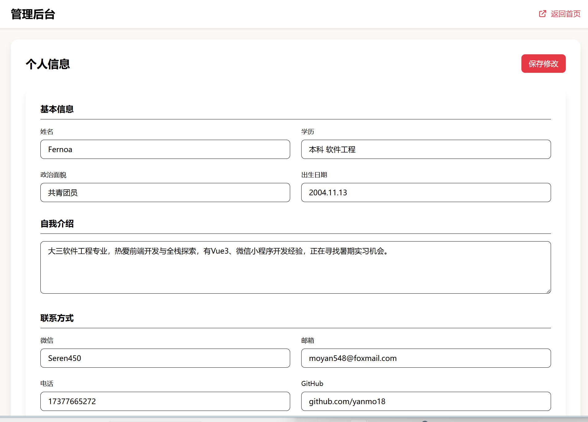
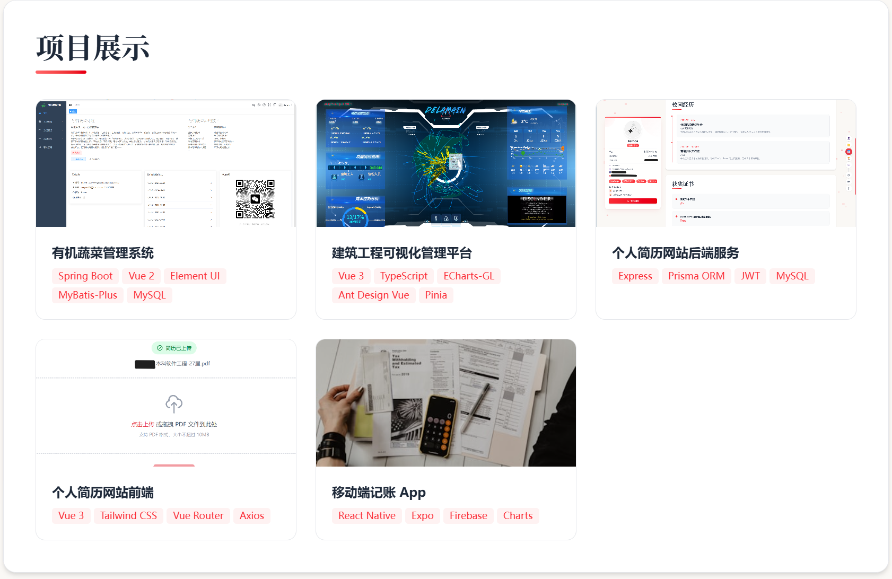
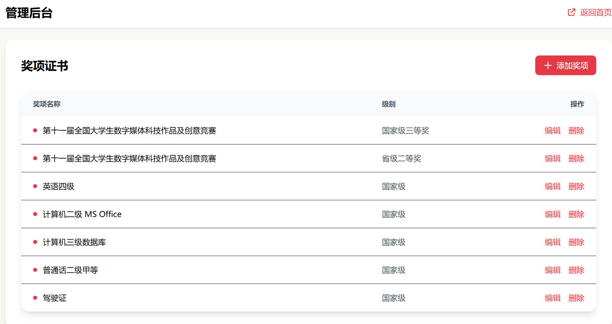
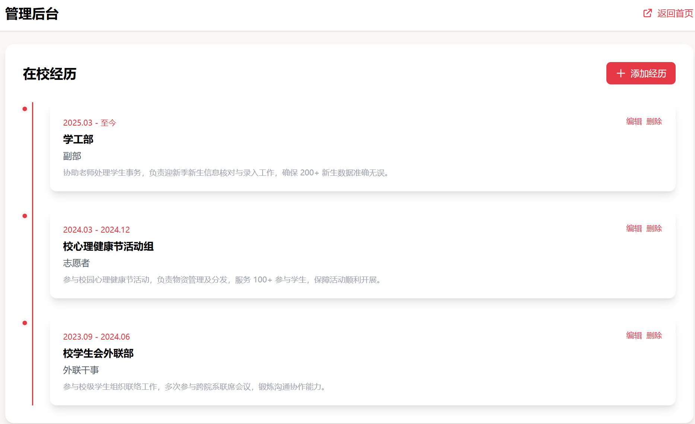
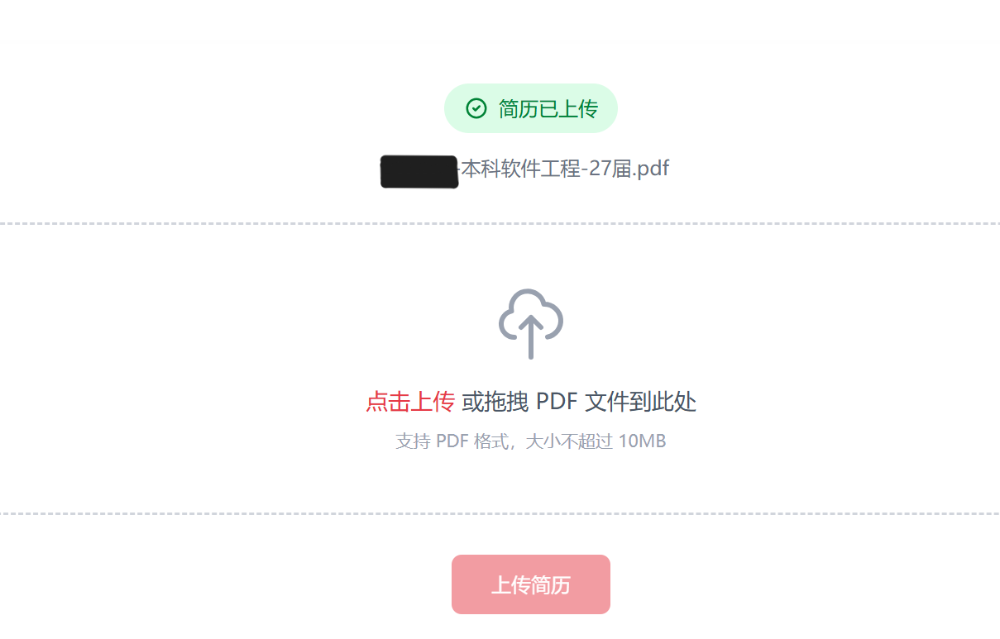

# 简历-个人作品集网站

> 🔥 A modern, responsive portfolio website built with Vue 3


## 📝 项目简介

这是一个基于 **Vue 3** 的个人作品集网站，展示个人简历、项目作品、获奖经历和校园经历。采用前后端分离架构，支持中英双语切换，响应式设计适配多端设备。

**[👉 在线预览](https://my-portfolio-md5p2rqvt3.edgeone.cool/)** | **[👤 管理后台](https://my-portfolio-md5p2rqvt3.edgeone.cool/admin/projects)**



## ✨ 功能特点

### 🎨 界面设计
- 📱 **响应式布局** - 适配桌面、平板、手机等多种设备
- 🎯 **简约现代风格** - 米白底色 + 大红色强调，专业干净
- ✨ **流畅动画** - 滚动入场动画、悬停效果、卡片翻转
- 🌍 **中英双语** - 一键切换中/英文界面
- 🖼️ **双栏布局** - "关于我"板块左右分栏，文字+插画

### 📦 功能模块
- **首页展示**
  - 左侧固定资料卡片（头像、技能、联系方式）
  
  - 右侧内容区域（关于我、获奖证书、项目展示、校园经历、联系方式）
  - 右侧悬浮电梯导航 + 语言切换
  - "Hire Me" 按钮，点击跳转联系方式
- **管理后台**（需登录）
  - 登录页面：双层镂空渐变边框旋转动画 + 鼠标跟随效果
  
  - 个人信息管理
  
  - 项目管理（可视化图片上传、缩略图预览、增删改查）
  
  - 奖项管理（增删改查）
  
  - 校园经历管理（增删改查）
  
  - 简历上传/下载
  

### 🔐 安全特性
- **管理后台登录验证** - 防止未授权访问
- **JWT 认证机制** - 安全的状态管理
- **路由守卫** - 未登录自动跳转登录页
- **退出登录功能** - 一键清除登录状态

### 🔧 技术特性
- ⚡ **Vite 构建** - 极快的开发服务器和热更新
- 🎭 **Tailwind CSS** - 原子化 CSS，快速样式开发
- 🔄 **API 降级** - 后端不可用时自动使用本地 Mock 数据
- 📊 **实时数据** - 连接 Laf 云函数，实时同步
- 💾 **智能缓存** - localStorage 自动备份数据

## 🛠️ 技术栈

| 技术 | 说明 |
|------|------|
| **Vue 3** | 渐进式 JavaScript 框架 |
| **Vite** | 下一代前端构建工具 |
| **Tailwind CSS** | 原子化 CSS 框架 |
| **Vue Router** | Vue 官方路由管理器 |
| **Vue I18n** | Vue 国际化插件 |
| **Laf** | Serverless 云开发平台 + MongoDB |

## 📁 项目结构

```
my-portfolio/
├── public/                    # 静态资源
├── assets/                    # Git 跟踪的展示图片
├── screenshots/               # 截图存放目录
├── src/
│   ├── api/                   # API 接口层
│   │   ├── index.js          # API 适配层（智能降级）
│   │   └── mockData.js       # Mock 默认数据
│   ├── components/            # 公共组件
│   ├── composables/           # 组合式函数
│   │   └── useScrollAnimation.js  # 滚动动画
│   ├── i18n/                  # 国际化配置
│   │   ├── zh.js            # 中文
│   │   └── en.js            # 英文
│   ├── router/               # 路由配置（含守卫）
│   ├── views/                # 页面组件
│   │   ├── Home.vue         # 首页
│   │   ├── Login.vue        # 登录页
│   │   └── admin/           # 管理后台
│   ├── App.vue
│   ├── main.js              # 入口文件
│   └── style.css            # 全局样式 + 动画
├── index.html
├── vite.config.js
└── package.json
```

## 🚀 快速开始

### 环境要求
- Node.js 18+
- pnpm 10+

### 安装依赖

```bash
# 克隆项目
git clone https://github.com/yanmo18/my-portfolio.git

# 进入目录
cd my-portfolio

# 安装依赖
pnpm install
```

### 开发预览

```bash
# 启动开发服务器
pnpm dev

# 访问 http://localhost:5000
```

### 生产构建

```bash
# 构建生产版本
pnpm build

# 预览构建结果
pnpm preview
```

## 📝 页面路由

| 路径 | 页面 | 说明 |
|------|------|------|
| `/` | 首页 | 作品集展示 |
| `/login` | 登录页 | 管理后台入口（动画效果） |
| `/admin` | 管理后台入口 | 需登录 |
| `/admin/profile` | 个人信息管理 | - |
| `/admin/projects` | 项目管理 | CRUD + 可视化上传 |
| `/admin/awards` | 奖项管理 | CRUD |
| `/admin/experience` | 经历管理 | CRUD |
| `/admin/resume` | 简历管理 | 上传/下载 |

## 🔌 后端 API

项目使用 **Laf 云函数** 提供后端服务

### 接口列表

| 接口 | 方法 | 说明 |
|------|------|------|
| `/get-profile` | GET | 获取个人信息 |
| `/update-profile` | PUT | 更新个人信息 |
| `/get-projects` | GET | 获取项目列表 |
| `/add-project` | POST | 添加项目 |
| `/update-project` | PUT | 更新项目 |
| `/delete-project` | DELETE | 删除项目 |
| `/get-awards` | GET | 获取奖项列表 |
| `/add-award` | POST | 添加奖项 |
| `/update-award` | PUT | 更新奖项 |
| `/delete-award` | DELETE | 删除奖项 |
| `/get-experience` | GET | 获取经历列表 |
| `/add-experience` | POST | 添加经历 |
| `/update-experience` | PUT | 更新经历 |
| `/delete-experience` | DELETE | 删除经历 |
| `/upload-resume` | POST | 上传简历 |

## 🎨 配色方案

| 用途 | 颜色 | 说明 |
|------|------|------|
| 背景色 | `#FAF8F5` | 米白色 |
| 强调色 | `#e63946` | 大红色 |
| 卡片背景 | `#FFFFFF` | 纯白 |
| 正文文字 | `#000000` | 黑色 |
| 次要文字 | `#6B7280` | 灰色 |
| 辅助色 | `#f4a261` | 橙色 |

## 🌐 部署

### 腾讯云部署

项目部署在 **腾讯云 EdgeOne Pages**，每次推送到 `main` 分支自动构建部署。

**部署地址：** https://my-portfolio-galxgagi.edgeone.cool/

### 自动部署

每次推送到 `main` 分支，腾讯云会自动构建和部署。

### 本地部署到其他平台

1. Fork 本项目到你的 GitHub
2. 连接到你的部署平台（如 Vercel、Netlify、腾讯云等）
3. 配置构建命令：
   - Build Command: `pnpm build`
   - Output Directory: `dist`
4. 部署完成

## 📊 更新日志

### v2.0.0 (2025.05)
**新增功能：**
- ✨ 管理后台登录验证系统
  - 双层镂空渐变边框旋转动画
  - 鼠标跟随效果
  - 登录凭证：admin / Fernoa@2024
- ✨ 可视化图片上传
  - 本地文件选择器
  - 缩略图预览
  - 支持多种图片格式
- ✨ "关于我"板块重构
  - 左右分栏布局
  - 右侧插画展示
  - "Hire Me" 按钮
- ✨ 页面入场动画优化
  - 各区块滚动入场动画
  - 鼠标悬停触发动画
  - 多样化动画效果

**Bug 修复：**
- 🐛 修复后端返回空数据时显示空白的问题
  - 现在会自动降级到 Mock 默认数据
- 🐛 修复云函数参数名不匹配问题
  - update-project / update-experience 的 _id 参数
- 🐛 修复保存后数据不刷新问题
  - 个人信息、获奖证书保存后自动刷新
- 🐛 修复简历模块证书显示硬编码问题
  - 改为动态读取 profile.certifications

**样式优化：**
- 💄 优化整体间距和布局
- 💄 自我介绍支持换行显示
- 💄 板块间距调整
- 💄 登录页动画效果迭代

### v1.0.0 (2025.04)
**初始版本：**
- 📦 基础项目架构搭建
- 📦 首页展示模块
- 📦 管理后台 CRUD 功能
- 📦 中英双语切换
- 📦 Laf 云函数后端集成

## 🔧 开发指南

### 添加新页面
1. 在 `src/views/` 下创建页面组件
2. 在 `src/router/index.js` 中添加路由（含守卫逻辑）
3. 在导航栏添加链接

### 添加新 API
1. 在 Laf 后台创建云函数
2. 在 `src/api/index.js` 中添加调用方法
3. 自动降级逻辑已内置

### 修改样式
样式使用 Tailwind CSS，参考 [官方文档](https://tailwindcss.com/docs)。

自定义样式在 `src/style.css` 中，包含动画定义。

## 📂 目录说明

| 目录 | 用途 |
|------|------|
| `public/` | 静态资源（图片等，构建时复制到根目录） |
| `assets/` | Git 跟踪的展示图片（README 用） |
| `screenshots/` | 截图存放目录（不会被清理） |

## 📄 License

MIT License - 欢迎使用！

## 👤 作者

**Fernoa**
- GitHub: [@yanmo18](https://github.com/yanmo18)
- Email: yanqing@outlook.com

---

<p align="center">
  <sub>Built with ❤️ by Vue 3 + Laf + 腾讯云</sub>
</p>
